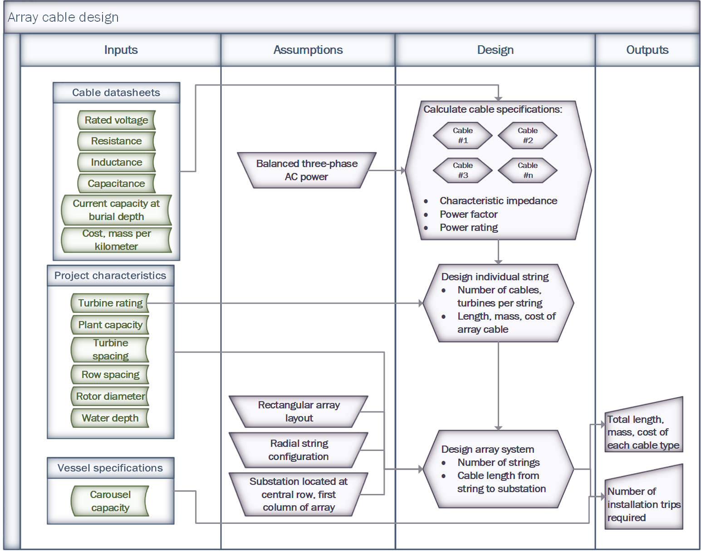

#######################################
Array Cabling System Design Methodology
#######################################

For details of the code implementation, please see
:doc:`Array System Design API <api_ArraySystemDesign>`.

Overview
========

Below is an overview of the whole process to create an array cabling
system. In the following sections, each piece will be reviewed in
greater detail. For more details on the helper classes used to support
this design please see: :doc:`Cabling Helper Classes <doc_CableHelpers>`

As of the current version of the code there are two array cabling layouts that
will be considered: grid and ring. In Fig 1 below we have a grid layout where
there is a pre-determined distance between turbines on a string and turbines in
a row and where there are only "full strings" being utilized. In Fig 2. we have
a ring layout where the there is a predetermined distance between turbines on a
string but the distance between rows of turbines is determined by evenly
spacing strings around a circle and where there is a need to have a "partial
string". The below sections will review the key steps in building out the array
cabling system.

+------------------------------------------------------------+---------------------------------------------------------------+
| .. image:: ../../../images/examples/full_grid_example.png  | .. image:: ../../../images/examples/partial_ring_example.png  |
+------------------------------------------------------------+---------------------------------------------------------------+
|    Fig 1. Grid layout with no partial strings              |    Fig 2. Ring layout with 1 partial string                   |
+------------------------------------------------------------+---------------------------------------------------------------+

Determine the strings
=====================

In order to create the minimum number of strings required to complete a
"standardized" array cable layout we must first determine how many turbines
can fit on a given cable type without overloading it and then how many turbines
can fit on a given string from the provided cable type(s).

Maximum turbines per cable
--------------------------

The maximum number of turbines that can fit on each cable is determined by
dividing each cable type's power rating by the a turbine's rated capacity  and
rounding down to the nearest integer.

:py:attr:`Cable.max_turbines` = :math:`\lfloor\frac{P}{turbine\_rating}\rfloor`,
where

| :math:`P` = :py:attr:`Cable.power`
| :py:attr:`turbine_rating` = rated capacity of a single turbine

Create the possible strings
---------------------------

First we have to create a full string and determine how many full strings are
required to connect the offshore substation to all of the turbines and if there
are not an evenly divided number of turbines to use only full strings then will
utilize one partial string to keep use for the remainder. See below for more.

:py:attr:`num_full_strings` = :math:`\lfloor \frac{Plant.num\_turbines}{num\_turbines\_full\_string} \rfloor`

:py:attr:`num_partial_strings` = :math:`Plant.num\_turbines \ \% \ num\_turbines\_full\_string`

How to compute a string
^^^^^^^^^^^^^^^^^^^^^^^

A string can contain as many turbines as the largest sized cable can
carry. To create a full string, starting from the smallest available string we
continuously add cable sections until that cable's maximum is reached, and then
repeat this for each of the next largest cables until the that cable's maximum
is reached or the string's maximum is reached.

For a partial string the main constraint is the remainder portion of the number
of full strings required to fully connect the wind farm.

.. code-block:: py
   :name: string-computation

   # Assume that we are using the Fig 1. example so there can only be 6
   # turbines contained in a single string of cables
   max_turbines_per_string = 6

   # Keeping with the Fig 1. example, assume cable1 is a Cable object that
   # represents the "XLPE_400mm_36kV" cable from and cable2 represents the
   # "XLPE_630mm_36kV" cable. Note that this is sorted from smallest to largest.
   cable_list = [cable1, cable2]

   # Start with an empty string
   cable_layout = []
   n = len(cable_layout)

   # Loop through the cables as long as we haven't reached the string maximum
   # and there are cables in cable_list
   while n < max_turbines_per_string and cables:
       cable = cable_list.pop(0)  # remove the first cable in the list

       # Ensure that the most turbines in a string is is lower than the
       # string maximum and the maximum the individual cable can support,
       # then add another cable.
       while max_turbines_per_string > n < cable.max_turbines:
           cable_layout.append(cable.name)
           n = len(cable_layout)

After running :py:func:`cable_layout` will be a list of cable sections starting
from the offshore substation and ending at the last turbine on a string and
will look like the following:

:py:attr:`full_string` = ``["XLPE_630mm_36kV", "XLPE_630mm_36kV", "XLPE_400mm_36kV",``
``"XLPE_400mm_36kV", "XLPE_400mm_36kV", "XLPE_400mm_36kV"]``

In the Fig 1. example there will be 7 of these full_strings. In the
Fig 2. example there will be 6 these full strings and one partial string as
as follows:

:py:attr:`partial_string` = ``["XLPE_400mm_36kV", "XLPE_400mm_36kV", "XLPE_400mm_36kV"]``

Create the layout
=================

In all 3 of the cases below an x and y coordinate array will be created for the
turbines where strings correspond to the rows of the array correspond to the
columns. In the case where there are partial strings, their corresponding
positions in the array will be filled with ``None``.

Ring
----

For the ring layout we first calculate the radius for each turbine on a string
using the :py:attr:`turbine_distance` and :py:attr:`substation_distance`,
then we determine the angle that each string is located at to create an evenly
spaced ring, such as that in Fig. 2. To compute the x-coordinates we then take
the sine of the radians and multiply it by the radius array. Similarly,
for the y-coordinates we take the cosine of the radians and multiple it by the
radius array. An array is then populated with the (x, y) coordinates extending
from the offshore substation located at (0, 0).

Grid
----

For the grid layout we first compute the evenly spaced grid of (x, y)
coordinates of each turbine based off the :py:attr:`turbine_distance`,
:py:attr:`row_distance`, and :py:attr:`substation_distance` with offshore
substation being located at (0, (:py:attr:`num_strings` - 1) * :py:attr:`row_distance` / :py:attr:`num_strings`)

Custom
------

Coming soon!

Create the section lengths
==========================

To compute the distance between turbines in a string we take the norm of the
difference between the subsequent turbines in a string. In this step an array
of cable types is created that correspond to the cable sections starting from
the offshore substation.

Using the section lengths and cable sections a :py:attr:`design_result`
can be exported and passed to the
:doc:`array cable installation simulation <../install/array/doc_ArrayCableInstallation>`.

References
==========
