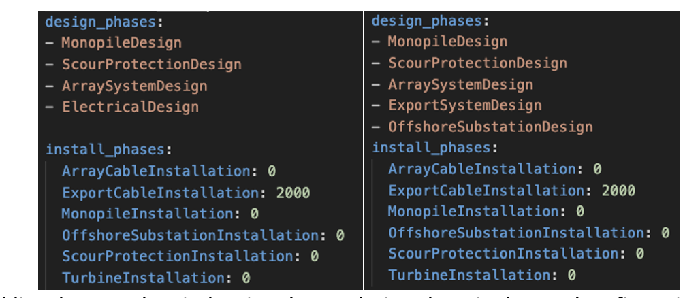

.. _changelog:

ORBIT Changelog
===============

Unreleased (TBD)
----------------
- merged SemiTaut_Mooring_Update
- The ``MooringSystemDesign`` module now can use a Catenary or SemiTaut mooring system. User can specify "mooring_type".
- The ``FloatingOffshoreSubstation`` and ``ElectricalDesign`` modules now actually have a floating option to remove any substructure mass (and cost) from older versions. User can specify "oss_substructure_type"
- The ``MoredSubInstallation`` now utilizes an AHTS vessel which must be added to any config file as (ahts_vessel)
- "drag_embedment_install_time" increased from 5 to 12 hours
- quayside turbine tower section lift time from 12 to 4 hours per section. User specifies number of sections (default =1)
- quayside nacelle lift time changed from 7 to 12 hours
Unreleased (TBD)
----------------
- merged electrical-refactor
- Updated ``ElectricalDesign`` module.
This class combines the elements of ``ExportSystemDesign`` and the ``OffshoreSubstationDesign`` modules. Its purpose is to represent the export system more accurately
by linking the type of cable (AC versus DC) and substation’s components (i.e. transformers versus converters).Figure 1 shows how to add ElectricalDesign() to a yaml
configuration file. Most export and substation component costs were updated to include a per-unit cost rather than a per-MW cost rate and they can be added to the
yaml file as arguments too. Otherwise, those per-unit costs use default and were determined with the help of a subcontractor.
    - This module’s components’ cost scales with number of cables and substations rather than plant capacity.
    - The offshore substation cost is calculated based on the cable type and number of cables, rather than scaling function based on plant capacity.
    - The mass of an HVDC and HVAC substation are assumed to be the same. Without any new information the substructure mass and cost functions did not change.
    - An experimental onshore cost function was also added to account for the duplicated interconnection components. Costs will vary depending on the cable type.

Figure 1: Adding the new ElectricalDesign class to design phase in the yaml configuration file (left) versus using the original ExportDesignSystem and
OffshoreSubstationDesign classes (right). Note: ORBIT will not override output values from a design phase, so it will use the first instance and ignore
any subsequent designs that produce the same outputs.

- Added an example notebook: `Example - Using HVDC or HVAC`
This new example showcases the capabilities of the ``ElectricalDesign`` class. It demonstrates how to create projects using HVAC or HVDC cables and
how to use ParametricManager to compare the two design decisions.

- Expanded tests to demonstrate new features in ``ElectricalDesign``.

1.0.8
-----

- Added explicit methods for adding custom design or install phases to
  ProjectManager.
- Added WOMBAT compatibility for custom array system files.
- Fixed bug in custom array cable system design that breaks for plants with
  more than two substations.

1.0.7
-----

- Added ``SupplyChainManager``.
- Added ``JacketInstallation`` module.
- Added option to use dynamic supply chain in ``MonopileInstallation`` module.

1.0.6
-----

- Expanded tutorial and examples.
- Added templates for design and install modules.
- Added ports to library pathing.
- Misc. bugfixes.

1.0.5
-----

- Added initial floating offshore substation installation module.
- Added option to specific floating cable depth in cable design modules.
- Bugfix in ``project.total_capex``.

1.0.4
-----

- Added ability to directly prescribe weather downtime through the
  ``availability`` keyword
- Added support for generating linear models using ``ParametricManager``

1.0.2
-----

- Added ``ProjectManager.capex_breakdown``.

1.0.1
-----

- Default behavior of ``ParametricManager`` has been changed. Input parameters
  are now zipped together and ran as a discrete set of configs. To use the past
  functionality (finding the product of all input parameters), use the option
  ``product=True``
- Bugfix: Added port costs to floating substructure installation modules.
- Revised docs for running the Example notebooks and added link to a tutorial
  about working with jupyter notebooks.

1.0.0
-----

- New feature: ``ParametricManager`` for running parametric studies.
- Added procurement cost inputs and total cost methods to installation phases.
  Design phases are now only used to fill in the design and do not return a
  cost associated with the design.
- Refactored aggregation project level outputs in ``ProjectManager``.
- Revised Net Present Value calculation to utilize new project outputs.
- Added ``load_config`` and ``save_config`` functions.
- Moved ``ORBIT.library`` to ``OBRIT.core.library``.
- Centralized model defaults to ``ORBIT.core.defaults``.
- ``ProjectManager.project_actions`` renamed to ``ProjectManager.actions``
- ``ProjectManager.project_logs`` renamed to ``ProjectManager.logs``
- ``ProjectManager.run_project()`` renamed to ``ProjectManager.run()``
- Moved documentation hosting to gh-pages.

0.5.1
-----

- Process time kwargs should now be passed through ``ProjectManager`` in a
  dictionary named ``processes`` in the config.
- Revised ``prep_for_site_operations`` and related processes to allow for
  dynamically positioned vessels.
- Updated WISDEM API to include floating functionality.

0.5.0
-----

- Initial release of floating substructure functionality in ORBIT.
- New design modules: ``MooringSystemDesign``, ``SparDesign`` and
  ``SemiSubmersibleDesign``.
- New installation modules: ``MooringSystemInstallation`` and
  ``MooredSubInstallation``
- Cable design and installation modules modified to calculate catenary lengths
  of suspended cable at depths greater than 60m.

0.4.3
-----

- New feature: Cash flow and net present value calculation within
  ``ProjectManager``.
- Revised ``CustomArraySystemDesign`` module.
- Revised assumptions in ``MonopileDesign`` module to bring results in line
  with industry numbers.

0.4.2
-----

- New feature: Phase dependencies in ``ProjectManager``.
- New feature: Windspeed constraints at multiple heights, including automatic
  interpolation/extrapolation of configured windspeed profiles.
- Added option to define ``mobilization_days`` and ``mobilization_mult`` in a
  ``Vessel`` configuration file.
- Added option for pre-installation trenching operations to
  ``ArrayCableInstallation`` and ``ExportCableInstallation``.
- Revised ``OffshoreSubstationDesign`` to scale the size of the substations
  with the user-configured number of substations.
- Bugfix in the returned argument order of ``ProjectManager.run_install_phase``
  where the cost of a prior phase would be incorrectly applied as the elapsed
  time.

0.4.1
-----

- Modified installation to require version of marmot-agents that has an
  internal copy of simpy.
- Added/expanded ``detailed_outputs`` for all modules.
- Standardized naming of weight/mass terms to mass throughout the model.
- Cleanup in ``ProjectManager``.

0.4.0
-----

- Vessel mobilization added to all vessels in all installation modules.
  Defaults to 7 days at 50% day-rate.
- Cable lay, bury and simulataneous lay/bury methods are not flagged as
  suspendable to avoid unrealistic project delays.
- Cost of onshore transmission construction added to
  ``ExportCableInstallation``.
- Simplified ``ArrayCableInstallation``, ``ExportCableInstallation`` modules.
- Removed `pandas` from the internals of the model, though it is still useful
  for tabulating the project logs.
- Revised package structure. Functionally formerly in ORBIT.simulation or
  ORBIT.vessels has been moved to ORBIT.core.
- ``InstallPhase`` cleaned up and slimmed down.
- ``Environment`` and associated functionality has been replaced with
  ``marmot.Environment``.
- Logging functionality revised. No longer uses the base python logging module.
- ``Vessel`` now inherits from ``marmot.Agent``.
- Tasks that were in ``ORBIT.vessels.tasks`` have been moved to their
  respective modules and restructured with ``marmot.process`` and
  ``Agent.tasks``.
- Modules inputs cleaned up. ``type`` parameters are no longer required for
  monopile, transition piece or turbine component definitions.
- Removed old/irrelevant tests.

0.3.5
-----

- Added 'per kW' properties to ``ProjectManager`` CAPEX results.

0.3.4
-----

- Added configuration to ``ProjectManager`` that allows exceptions to be caught
  within individual modules and allows the project as a whole to continue.
- Fixed installation process when installing from GitHub.

0.3.3
-----

- Added configuration for multiple tower sections in ``TurbineInstallation``.
- Added configuration for seperate lay/burial in ``ArrayCableInstallation`` and
  ``ExportCableInstallation``.
- Overhauled test suite and associated library.
- Bugfix in ``CableCarousel``.
- Expanded WISDEM Fixed API.

0.3.2
-----

- Initial release of fixed substructure WISDEM API
- Material cost for monopiles and transition pieces added to ``MonopileDesign``
- Updated ``ProjectManager`` to allow user to override default ``DesignPhase``
  results
- Moved config validation to ``BasePhase`` and added call to
  ``self.validate_config`` for all current modules
- Config validation logic reworked so dicts of optional values are not
  required
- Added method to resolve project capacity in ``ProjectManager``. A user can
  now input ``plant.num_turbines`` and ``turbine.turbine_rating`` and
  ``plant.capacity`` will be added to the config.
- Added initial set of standardized inputs to ``ProjectManager``:

  - ``self.installation_capex``
  - ``self.installation_time``
  - ``self.project_days``
  - ``self.bos_capex``
  - ``self.turbine_capex``
  - ``self.total_capex``

0.3.1
-----

- Updated README
