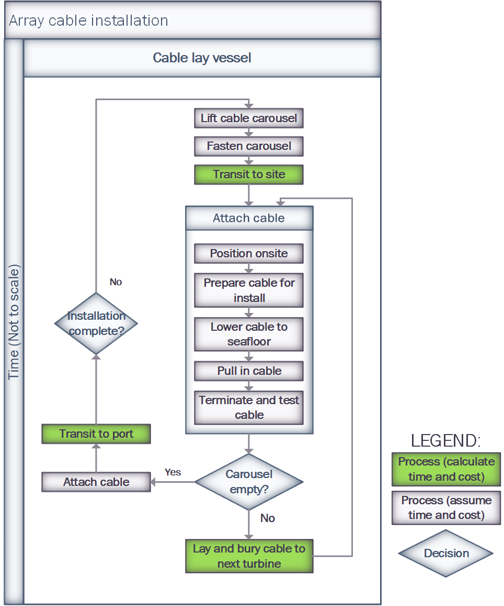

Array Cabling System Installation Methodology
=============================================

For details of the code implementation, please see
:doc:`Array Cable Installation API <api_ArrayCableInstall>`.

Overview
--------

The ``ArrayCableInstallation`` module simulates the installation of array cable
sections between turbines and the offshore substation at site. This process is
one of the critical installation phases in the construction of a wind farm as
testing and final commissioning of the turbines can't occur until it is
complete.

The installation of cables offshore is a complex process that depends on the
geotechnical parameters of the seabed along the cable route. Detailed
geotechnical data is typically not publicly available for all potential
offshore wind sites in the U.S., and as such, ORBIT was designed to allow a
user to investigate the impact of seabed conditions indirectly without
requiring detailed descriptions of the seabed. This is primarily done by
adjusting the cable burial speed, with harder or rockier soils requiring a
slower (and ultimately more expensive) burial speed.

Input Structure
---------------

The design of the input data structure for this module allows the user to
define site specific array cable configurations. For each cable type, a list
of cable sections can be defined. The installation vessel will install each
section individually and the time to complete this operation is dynamic based
on the length and the linear density of the cable, site depth, etc. A user can
also define multiple cable types that comprise an individual string of
turbines.

For example,

.. code-block::

   {
       'array_system': {
           'cables': {'XLPE_400mm_33kV': {
               'cable_sections': [
                    (1.7958701547, 2),  # There are two 1.79km sections,
                    (1.118, 16),        # 16 1.118km sections
                    (1.2128290583, 2)   # and two 1.213km sections
               ],
               'linear_density': 35
           }
       }
   }

The installation of each section above will be modeled seperately. In the above
example, only one cable was used, though there could be additional defined
cables (with their own `cable_sections` key).

.. note::

   The above data structure can be input directly by the user, or can be a
   result of running the ``ArraySystemDesign`` module.

.. _cable_strategies:

Configuration
-------------

ORBIT considers two installation strategies: a simultaneous lay/bury operation
using modern cable installation vessels and a seperated operation where one
vessel lays the cable and another follows behind to bury it. A detailed
description of the applicability of each strategy is covered in the ORBIT
technical `report <https://www.nrel.gov/docs/fy20osti/77081.pdf>`_.

If the config contains the key ``'array_cable_bury_vessel'`` the separate
strategy will be used. If this key is not present, the
``'array_cable_install_vessel'`` will perform a simultaneous lay/bury of the
cable.

The key ``'array_cable_trench_vessel'`` is an optional configuration that will
simulate a separate trenching operation along all cable routes completed by
the above vessel. If this key is not present, this operation will not be
modeled.

.. code-block::

   {
       'array_cable_install_vessel': 'example_vessel'
       # 'array_cable_bury_vessel': 'example_vessel',
       # 'array_cable_trench_vessel': 'example_vessel',
       'array_system': {
           'cables': {'XLPE_400mm_33kV': {
               ...
           }
       }
   }

Processes
---------

The speed at which a vessel can perform the operations of each installation
strategy is determined by the vessel properties, passed kwargs or the
default speed for the process. This is the primary mechanism that a user can
adjust cable installation times for different seabed conditions.

+------------------+--------------------------+------------+
| Strategy         | Key                      | Default    |
+==================+==========================+============+
| Lay/Bury Cable   | ``cable_lay_bury_speed`` | 0.3 km/hr  |
+------------------+--------------------------+------------+
| Lay Cable        | ``cable_lay_speed``      | 1 km/hr    |
+------------------+--------------------------+------------+
| Bury Cable       | ``cable_bury_speed``     | 0.5 km/hr  |
+------------------+--------------------------+------------+

Other operations in the installation process are determined by default values:

+-----------------+----------------------------+---------+
|     Process     |            Key             | Default |
+=================+============================+=========+
| Position Onsite | ``site_position_time``     | 2h      |
+-----------------+----------------------------+---------+
| Prepare Cable   | ``cable_prep_time``        | 1h      |
+-----------------+----------------------------+---------+
| Lower Cable     | ``cable_lower_time``       | 1h      |
+-----------------+----------------------------+---------+
| Pull in Cable   | ``cable_pull_in_time``     | 5.5h    |
+-----------------+----------------------------+---------+
| Test Cable      | ``cable_termination_time`` | 5.5h    |
+-----------------+----------------------------+---------+

Configuration Examples
~~~~~~~~~~~~~~~~~~~~~~

Coming soon!

Process Diagrams
----------------

