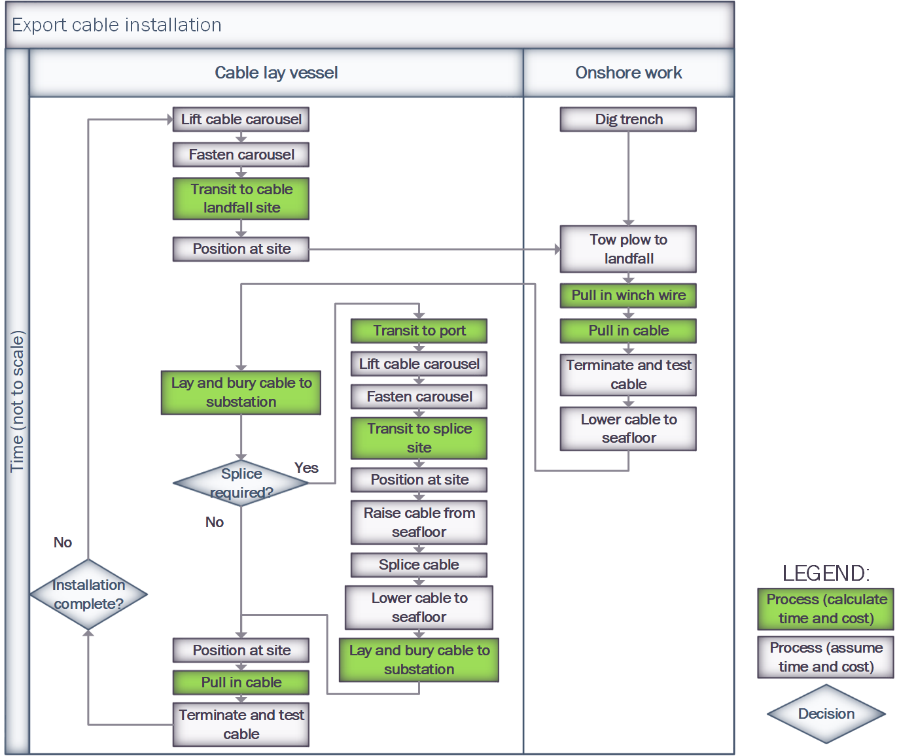

Export Cabling System Installation Methodology
==============================================

For details of the code implementation, please see
:doc:`Export Cable Installation API <api_ExportCableInstall>`.

Overview
--------

The ``ExportCableInstallation`` module simulates the installation of the cables
between the offshore substation and the grid connection. Many processes in this
installation phase are similar to those in the array cable installation module,
however the cable distances and process times are often much greater.

Input Structure
---------------

The design of the input data structure for this module is the same as the array
cable installation module. An example export system can be seen in the code
block below.

.. code-block::

   {
       'export_system': {
           'cables': {'XLPE_500mm_33kV': {
               'cable_sections': [
                    (35, 2),  # There are two 35km export cables to install
               ],
               'linear_density': 35
           }
       }
   }

.. note::

   The above data structure can be input directly by the user, or can be a
   result of running the ``ExportSystemDesign`` module.

Configuration
-------------

ORBIT considers the same possible installation strategies for array and export
cable systems. Please see this :ref:`section <cable_strategies>` for the
different installation methods available.

Processes
---------

Onshore Processes
~~~~~~~~~~~~~~~~~

At landfall, the cable must be pulled up onto shore, tested and terminated at
the grid connection point and buried. These processes utilize the following
inputs.

+---------------+----------------------------+-----------+
|    Process    |            Key             |  Default  |
+===============+============================+===========+
| Dig Trench    | ``trench_dig_speed``       | 0.1 km/hr |
+---------------+----------------------------+-----------+
| Tow Plow      | ``tow_plow_speed``         | 5 km/hr   |
+---------------+----------------------------+-----------+
| Pull in Winch | ``pull_winch_speed``       | 5 km/hr   |
+---------------+----------------------------+-----------+
| Pull in Cable | ``cable_pull_in_time``     | 5.5h      |
+---------------+----------------------------+-----------+
| Test Cable    | ``cable_termination_time`` | 5.5h      |
+---------------+----------------------------+-----------+

A detailed description of these processes is provided in the ORBIT technical
documentation.

Offshore Processes
~~~~~~~~~~~~~~~~~~

The offshore installation process utilize the same configurable speeds as the
array system installation:

+------------------+--------------------------+------------+
| Strategy         | Key                      | Default    |
+==================+==========================+============+
| Lay/Bury Cable   | ``cable_lay_bury_speed`` | 0.3 km/hr  |
+------------------+--------------------------+------------+
| Lay Cable        | ``cable_lay_speed``      | 1 km/hr    |
+------------------+--------------------------+------------+
| Bury Cable       | ``cable_bury_speed``     | 0.5 km/hr  |
+------------------+--------------------------+------------+

.. note::

   The cable lengths for an export system are typically much longer than the
   array system and thhere is the possibility that a cable splice will be
   needed. The time for splicing a cable can be configured by the user using
   the ``cable_splice_time`` key, which defaults to 48h.

Configuration Examples
~~~~~~~~~~~~~~~~~~~~~~

Coming soon!

Process Diagrams
----------------

