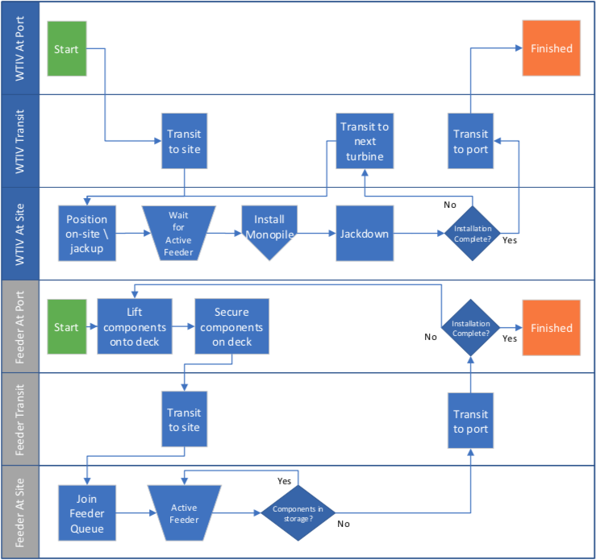

Monopile Installation Methodology
=================================

For details of the code implementation, please see
:doc:`Monopile Installation API <api_MonopileInstallation>`.

Overview
--------

The ``MonopileInstallation`` module simulates the installation of monopile
substructures at site. Monopile substructures encompass the monopile itself, a
large steel cylindrical pile that is driven into the seabed, and a steel
transition piece that is placed on top of the pile to provide a level
attachment point for the turbine. The module can be configured such that a
single wind turbine installation vessel (WTIV) transports and installs all of
the substructure components or it can be configured to include feeder barges
that transport the components to site. Process diagrams detailing the vessel
logistics for these two installation strategies can be seen below.

.. note::

   For both installation strategies the WTIV performs all of the on site
   operations with its onboard crane, either picking components from its own
   deck or a neighboring feeder barge.

Configuration
-------------

To configure ``MonopileInstallation`` to utilize feeder barges for transit of
the monopile components from port, add the following configuration to the
project configuration.

.. code-block:: python

   config = {
       ...

       "feeder": "example_feeder",  # name of vessel configuration file without extension
       "num_feeders": 2,

       ...
   }

Processes
---------

Port Operations
~~~~~~~~~~~~~~~

Vessels load and fasten items on their deck at port using the port crane.
Ports are configured with one crane by default, which limits multiple vessels
from accessing port resources at a time. This can be overridden by configuring
a port with additional cranes in a project configuration:

.. code-block:: python

   "port": {
       "num_cranes": 2  # Two vessels can access port resource simultaneously.
   }

The default times for fastening each component to deck are listed below.

+------------------+----------------------+------------+
| Component        | Inputs               | Default    |
+==================+======================+============+
| Monopile         | ``mono_fasten_time`` | 12h        |
+------------------+----------------------+------------+
| Transition Piece | ``tp_fasten_time``   | 8h         |
+------------------+----------------------+------------+

Currently, all vessels are only able to load multiples of complete sets of
components (monopile and transition piece).

Site Preperation
~~~~~~~~~~~~~~~~

Once the WTIV and a set of components are at site (either stored on the WTIV or
a feeder barge), the WTIV initiates site preperation. The WTIV positions itself
onsite and jacks up. If installing a monopile, the WTIV surveys the seabed with
an ROV. The following table outlines the inputs and default times for these
tasks.

+-----------------+--------------------------+------------+
| Action          | Inputs                   | Default    |
+=================+==========================+============+
| Position Onsite | ``site_position_time``   | 2h         |
+-----------------+--------------------------+------------+
| Jack-up         | | ``depth, extension``   | calculated |
|                 | | ``speed_above_depth``  |            |
|                 | | ``speed_below_depth``  |            |
+-----------------+--------------------------+------------+
| ROV Survey      | ``rov_survey_time``      | 1h         |
+-----------------+--------------------------+------------+

Monopile Installation
~~~~~~~~~~~~~~~~~~~~~

After site preperation is complete, the WTIV then releases the monopile from
the fastenings (either on its own deck or neighboring feeder barge). When the
substructure is released, it is upended using the WTIV crane and lowered to the
seabed. The crane is then equiped with the driving equipment, and the monopile
is driven into the seabed. ORBIT currently only supports simple drive
logistics, but a drive-drill-drive installation strategy is planned for future
version. Inputs and process times are summarized in the following table.

+------------------+--------------------------+------------+
| Action           | Inputs                   | Default    |
+==================+==========================+============+
| Release Monopile | ``mono_release_time``    | 3          |
+------------------+--------------------------+------------+
| Upend Monopile   | | ``monopile.length``    | calculated |
|                  | | ``crane_rate``         |            |
|                  | | ``wave_height``        |            |
+------------------+--------------------------+------------+
| Lower Monopile   | | ``site_depth``         | calculated |
|                  | | ``crane_rate``         |            |
+------------------+--------------------------+------------+
| Reequip Crane    | ``crane_reequip_time``   | 1h         |
+------------------+--------------------------+------------+
| Drive Monopile   | | ``mono_drive_rate``    | calculated |
|                  | | ``mono_embed_len``     |            |
+------------------+--------------------------+------------+

Transition Piece Installation
~~~~~~~~~~~~~~~~~~~~~~~~~~~~~

After the monopile is installed, the WTIV lowers and attaches the
transition piece onto the top of the monopile using the following processes:

+------------------+--------------------------+------------+
| Action           | Inputs                   | Default    |
+==================+==========================+============+
| Reequip Crane    | ``crane_reequip_time``   | 1h         |
+------------------+--------------------------+------------+
| Lower TP         | | ``air_gap``            | calculated |
|                  | | ``crane_rate``         |            |
|                  | | ``wave_height``        |            |
+------------------+--------------------------+------------+

The transition piece can be attached with either a bolted or a grouted
connection. The bolted connection is selected by default. To configure the WTIV
to use a grouted connection, pass ``tp_connection_type="grouted"`` into the
installation module.

For bolted connections, the WTIV performs these tasks:

+------------------+--------------------------+------------+
| Action           | Inputs                   | Default    |
+==================+==========================+============+
| Bolt TP          | ``tp_bolt_time``         | 4h         |
+------------------+--------------------------+------------+
| Jack-down        | | ``depth, extension``   | calculated |
|                  | | ``speed_above_depth``  |            |
|                  | | ``speed_below_depth``  |            |
+------------------+--------------------------+------------+

For grouted connections, the WTIV performs these tasks:

+------------------+--------------------------+------------+
| Action           | Inputs                   | Default    |
+==================+==========================+============+
| Pump Grout       | ``grout_pump_time``      | 2h         |
+------------------+--------------------------+------------+
| Cure Grout       | ``grout_cure_time``      | 24h        |
+------------------+--------------------------+------------+
| Jack-down        | | ``depth, extension``   | calculated |
|                  | | ``speed_above_depth``  |            |
|                  | | ``speed_below_depth``  |            |
+------------------+--------------------------+------------+

Process Diagrams
----------------

Single WTIV Installation
~~~~~~~~~~~~~~~~~~~~~~~~

.. image:: ../../../images/process_diagrams/monopile_single_wtiv.png

.. _monopile_install_feeders:

WTIV with Feeder Barges Installation
~~~~~~~~~~~~~~~~~~~~~~~~~~~~~~~~~~~~

Component Installation
~~~~~~~~~~~~~~~~~~~~~~

.. image:: ../../../images/process_diagrams/monopile_install.png
